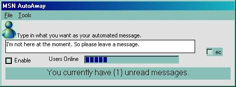



## MSN AutoAway

### Description

This program interfaces with MSN Messenger and Windows Messenger to provide an Automatic away message. Advanced features such as Find User, and Login as Invisible are still being developed. Please add comments and lemme know what you think.

Sabiancrash
 
### More Info
 
Beware. This is an alpha version of the program. Expect many changes in look and functionality in the future.

             |
---                |---
**Submitted On**   |2002-04-14 19:54:48
**By**             |[Peter Sloan](https://github.com/Planet-Source-Code/PSCIndex/blob/master/ByAuthor/peter-sloan.md)
**Level**          |Intermediate
**User Rating**    |5.0 (10 globes from 2 users)
**Compatibility**  |VB 6\.0
**Category**       |[Complete Applications](https://github.com/Planet-Source-Code/PSCIndex/blob/master/ByCategory/complete-applications__1-27.md)
**World**          |[Visual Basic](https://github.com/Planet-Source-Code/PSCIndex/blob/master/ByWorld/visual-basic.md)
**Archive File**   |[MSN\_AutoAw720194142002\.zip](https://github.com/Planet-Source-Code/peter-sloan-msn-autoaway__1-33817/archive/master.zip)

